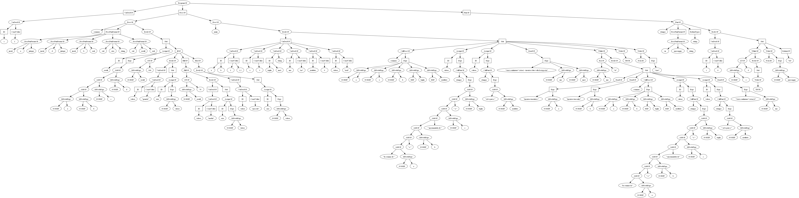

## Modifiche alla grammatica
[Immagine diagramma di stati LALR della grammatica](src/main/esercitazione5/images/LALR_states.svg)

Dopo le seguenti modifiche, la grammatica non presenta più alcun conflitto.
- Sono state rimosse tutte le produzione empty. Questo aggiunge un po' di verbosità alla grammatica ma
ne facilità la lettura, sopratutto per sapere subito come è formato un costrutto della grammatica.

- Il controllo che il Program abbia almeno una Procedura è stato rimandato alla fase semantica, nella 
quale comunque si sarebbe dovuto controllare che la procedura si chiamasse "main". Questa modifica ha 
permesso l'eliminazione di alcuni conflitti.

- _IOArgs_ diviso in _OArgs_ per gli argomenti di Write e _IArgs_ per gli argomenti di Read. Questo
permette di anticipare controlli della semantica e a usare generalizzazioni dei nodi senza la necessità
di aggiungere flags.

- In _OArgs_ originalmente si sarebbe dovuto controllare nella fase semantica che le _Expr_ senza 
dollaro siano delle concatenazioni di Stringhe. Questo controllo è stato anticipato nella grammatica
stessa. Questo ha permesso di eliminare molti conflitti.

- In _IArgs_ originalmente si sarebbe dovuto controllare nella fase semantica che le _Expr_ nel
  dollaro siano solamente singoli Identificatori. Questo controllo è stato anticipato nella grammatica
  stessa. Questo ha permesso di usare più generalizzazione nel codice.

- In _Function_ non è permesso avere un _Body_ vuoto. Questo perché Function per definizione ritorna
una o più espressioni. Nella fase semantica si controllerà che Body abbia una ReturnOP.

- Sono state aggiunte le precedenze alle operazioni delle Expr per risolvere i conflitti.

## Testing
In [src/test/java](src/test/java) sono stati scritti gli Unit Test sia per il Lexer che per il Parser.
Tra le configurazioni di Run, c'è una che avvia tutti gli Unit Test.

Nelle configurazioni del Run ci sono anche quelle per fare il testing dei file di input sia per il Lexer
che per il Parser.

## Visitors
Nel Run di [ParserTester](src/main/esercitazione5/ParserTester.java) sarà possibile scegliere uno dei seguenti visitor.
### DebugVisitor
1. (default) **DebugVisitor**: dopo aver fatto il parsing del source, visita l'AST e riscrive dall'AST il source.
Il source riscritto sarà equivalente nel significato ma alcune cose cambieranno come ad esempio
ogni VarDecl inizierà con _var_ mentre in Toy2 possiamo scrivere la keyword una volta e poi dichiarare
più VarDecl. Anche l'ordine di scrittura dei vari costrutti nello scope _GLOBAL_ non sarà mantenuto.

### GraphvizASTVisitor
2. **GraphvizASTVisitor** genera codice _[dot lang](https://graphviz.org/doc/info/lang.html)_, il quale 
è usato da [Graphviz](https://graphviz.org/) per generare graficamente l'AST. Sarà stampato a 
video il _dot lang_, è possibile copiarlo e incollarlo su [questo sito](http://magjac.com/graphviz-visual-editor/)
per visualizzare l'AST. Dal sito è possibile esplorare l'AST, per muoversi nell'albero basta tenere premuto CTRL
e usare il mouse per trascinare.

Qui sotto un esempio di AST sull'[input1.txt](/src/test_files/input1.txt), ossia il codice di esempio presente su e-learning.
[Link all'immagine.](src/main/esercitazione5/images/AST_input1.svg)

## Programma Math in Toy2
Così come richiesto dal punto #1 dell'esercitazione, è stato scritto un programma in Toy2 per fare operazioni
aritmetiche prendendo l'input dall'utente. Sono stati usati quasi tutti i costrutti della grammatica.

In [src/test_files/math.txt](src/test_files/math.txt) c'è il source code di Math in Toy2.

In [src/main/esercitazione4/images/AST_math.svg](src/main/esercitazione5/images/AST_math.svg) c'è il suo AST.
