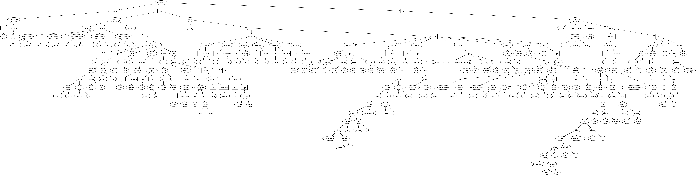

## CI
Per CI viene usato [Main.java](src/main/esercitazione5/Main.java) e rispetta le direttive di output.

## Modifiche alla grammatica

[Immagine diagramma di stati LALR della grammatica](src/main/esercitazione5/images/LALR.svg)

Dopo le seguenti modifiche, la grammatica non presenta più alcun conflitto.

- Sono state rimosse tutte le produzione empty. Questo aggiunge un po' di verbosità alla grammatica
  ma
  ne facilità la lettura, sopratutto per sapere subito come è formato un costrutto della grammatica.

- Il controllo che il Program abbia almeno una Procedura è stato rimandato alla fase semantica,
  nella
  quale comunque si sarebbe dovuto controllare che la procedura si chiamasse "main". Questa modifica
  ha
  permesso l'eliminazione di alcuni conflitti.

- _IOArgs_ diviso in _OArgs_ per gli argomenti di Write e _IArgs_ per gli argomenti di Read. Questo
  permette di anticipare controlli della semantica e a usare generalizzazioni dei nodi senza la
  necessità
  di aggiungere flags.

- In _OArgs_ originalmente si sarebbe dovuto controllare nella fase semantica che le _Expr_ senza
  dollaro siano delle concatenazioni di Stringhe. Questo controllo è stato anticipato nella
  grammatica
  stessa. Questo ha permesso di eliminare molti conflitti.

- In _IArgs_ originalmente si sarebbe dovuto controllare nella fase semantica che le _Expr_ nel
  dollaro siano solamente singoli Identificatori. Questo controllo è stato anticipato nella
  grammatica
  stessa. Questo ha permesso di usare più generalizzazione nel codice.

- In _Function_ non è permesso avere un _Body_ vuoto. Questo perché Function per definizione ritorna
  una o più espressioni. Nella fase semantica si controllerà che nella lista degli Stat del Body ci
  sia alla fine una ReturnOP. Questo ha un side-effect che costringe di avere sempre un return alla
  fine quindi in un if-else, il return non potrà stare nell'else ma bisogna metterlo fuori nello
  scope della funzione Però questo garantisce che il linguaggio target generato non abbia problemi.

- Sono state aggiunte le precedenze alle operazioni delle Expr per risolvere i conflitti.

- È stato aggiunto il nodo ElseOP in modo tale da poter accedere alla sua tabella di scope più
  facilmente.

- Non è possibile usare una funzione che ritorna più di 1 valore come
  argomento di una chiamata a funzione/procedura oppure un operatore binario o unario.
  Questo controllo avviene nella semantica ed è stato scelto di fare così perché altrimenti
  complicherebbe molto la generazione del linguaggio target C.

- È stato aggiunto un controllo semantico sulle condizioni del controllo di flusso e del while
  affinché non si ha che come condizione una funzione che ritorni più di un valore.

## Funzionalità aggiunte

- Nella generazione del codice C, se un ID ha come valore di stringa una keyword in C, al valore di
  quell'ID verrà aggiunto il suffix _repl__.
  _struct_ verrà rinominato in _repl_struct_.
- EQ e NE per le stringhe.

## Testing

In [src/test/java](src/test/java) sono stati scritti gli Unit Test sia per il Lexer, Parser,
Scoping e TypeChecking.
Tra le configurazioni di Run, c'è una che avvia tutti gli Unit Test.

Nelle configurazioni del Run ci sono anche quelle per fare il testing dei file di input nelle varie
fasi del compilatore.
Sono stati scritti i seguenti file di input:

- [elearning.toy2](test_files/elearning.toy2) il programma presente su elearning della somma.
- [math.toy2](test_files/math.toy2) il programma richiesto nel punto #1 dell'esercitazione 4,
  ossia una semplice calcolatrice.
- [multiplication.toy2](test_files/multiplication.toy2) prende in input un intero positivo e ne
  stampa la tabella delle moltiplicazioni da 0 a 10.
- [input3.toy2](test_files/input3.toy2) un programma che non fa niente di utile ma testa le
  funzioni con ritorno multiplo.
- [fibonacci.toy2](test_files/fibonacci.toy2) calcola la serie di Fibonacci per un _n_ e stampa
  se è pari.
- [pascalTriangle.toy2](test_files/pascalTriangle.toy2) stampa il Triangolo di Pascal per un
  numero di righe.

## Visitors

### Parser

Nel Run di [ParserTester](src/main/esercitazione5/ParserTester.java) sarà possibile scegliere uno
dei seguenti visitor.

1. **DebugVisitor**: dopo aver fatto il parsing del source, visita l'AST e riscrive dall'
   AST il source in Toy2.
   Il source riscritto sarà equivalente nel significato ma alcune cose cambieranno come ad esempio
   ogni VarDecl inizierà con _var_ mentre in Toy2 possiamo scrivere la keyword una volta e poi
   dichiarare
   più VarDecl.
   Le dichiarazioni di variabili verranno messe sempre all'inizio di ogni scope.

2. **GraphvizASTVisitor** genera codice
   _[dot lang](https://graphviz.org/doc/info/lang.html)_, il
   quale è usato da [Graphviz](https://graphviz.org/) per generare graficamente l'AST.
   Sarà stampato
   a video il _dot lang_, è possibile copiarlo e incollarlo
   su [questo sito](http://magjac.com/graphviz-visual-editor/) per visualizzare l'AST.
   Dal sito è
   possibile esplorare l'AST, per muoversi nell'albero basta tenere premuto CTRL e usare il mouse
   per trascinare.

Qui sotto un esempio di AST sull'[elearning.txt](/test_files/elearning.toy2), ossia il codice di
esempio presente su e-learning.
[Link all'immagine.](src/main/esercitazione5/images/AST_elearning.svg)



### Semantic

Nel Run di [SemanticTester](src/main/esercitazione5/SemanticTester.java) verrà usato il seguente
visitor.

**SemanticVisitor**: dopo aver fatto il parsing del source, visita l'AST e controlla alcune delle
regole semantiche.
Altre regole semantiche vengono controllate nella fase di scoping in quanto servono le tabelle di
scoping.

### Scoping

Nel Run di [ScopingTester](src/main/esercitazione5/ScopingTester.java) sarà possibile scegliere uno
dei seguenti visitor.

1. **ScopingVisitor**: dopo aver fatto il parsing del source, visita l'AST e crea le tabelle di
   scope, vengono anche effettuati tutti controlli semantici.
2. **GraphvizScopeTablesVisitor** genera codice
   _[dot lang](https://graphviz.org/doc/info/lang.html)_, il
   quale è usato da [Graphviz](https://graphviz.org/) per generare graficamente le tabelle di
   scoping.
   Sarà stampato a video il _dot lang_, è possibile copiarlo e incollarlo
   su [questo sito](http://magjac.com/graphviz-visual-editor/) per visualizzare le Tabelle di
   Scoping.
   Dal sito è possibile esplorare le tabelle, per muoversi tenere premuto CTRL e usare il mouse
   per trascinare.

Qui sotto un esempio di tabelle di scoping sull'[elearning.txt](/test_files/elearning.toy2),
ossia il
codice di esempio presente su e-learning.
[Link all'immagine.](src/main/esercitazione5/images/Scope_elearning.svg)


### TypeCheck

Nel Run di [TypeCheckTester](src/main/esercitazione5/TypeCheckTester.java) verrà usato il seguente
visitor.

**TypeCheckVisitor**: dopo aver fatto il parsing del source, controllo semantico e generazione delle
tabelle di scope, controlla che i Type siano rispettati.

### GenC

Nel Run di [GenCTester](src/main/esercitazione5/GenCTester.java) verrà usato il seguente
visitor.

**GenCVisitor**: dopo aver fatto il parsing del source, controllo semantico, generazione delle
tabelle di scope, controllo che i Type siano rispettati, genera il linguaggio target C.

## Gestione errori

- In caso ci sia un errore del **Lexer** si continua l'analisi emettendo un token _\<error\>_.
- In caso ci sia un errore del **Parser**, questo viene gestito da CUP.
- Nel caso ci sia uno degli errori **Semantico**, viene segnalato nella console su quale simbolo è
  l'errore e quale è il source code che lo compone.
  Gli errori Semantici considerati sono:
    - [MissingMainProc](src/main/esercitazione5/semantic/exceptions/MissingMainProcSemanticException.java)
    - [MissingReturnInFunc](src/main/esercitazione5/semantic/exceptions/MissingReturnInFuncSemanticException.java)
    - [NumIdsNumConstsDiff](src/main/esercitazione5/semantic/exceptions/NumIdsNumConstsDiffSemanticException.java)
      quando in una initialization il numero di variabili è diverso dal numero di
      costanti.
    - [ReturnInProc](src/main/esercitazione5/semantic/exceptions/ReturnInProcSemanticException.java)
- Nel caso ci sia un errore nello **Scoping**, viene segnalato nella console su quale simbolo è
  l'errore e quale è il source code che lo compone.
  Gli errori di Scoping considerati sono:
    - [AlreadyDeclared](src/main/esercitazione5/scope/exceptions/AlreadyDeclaredScopeException.java)
    - [Undeclared](src/main/esercitazione5/scope/exceptions/UndeclaredScopeException.java)
    - [NotAFunc](src/main/esercitazione5/scope/exceptions/NotAFuncScopeException.java) viene
      utilizzato quando si cerca di fare chiamata a funzione di un identificatore che in quel
      scope non è una funzione.
    - [NotAProc](src/main/esercitazione5/scope/exceptions/NotAProcScopeException.java) viene
      utilizzato quando si cerca di fare chiamata a procedura di un identificatore che in quel
      scope non è una procedura.
    - [NumAssignExprIncorrect](src/main/esercitazione5/scope/exceptions/NumAssignExprIncorrectScopeException.java)
      quando il numero di Expr è diverso dal numero di variabili in
      un'assegnamento.
    - [NumArgsExprIncorrect](src/main/esercitazione5/scope/exceptions/NumArgsExprIncorrectScopeException.java)
      quando si passa un numero errato di argomenti alla chiamata di una funzione
      o procedura.
    - [NumReturnExprIncorrect](src/main/esercitazione5/scope/exceptions/NumReturnExprIncorrectScopeException.java)
      quando in una funzione il return non ritorna lo stesso numero di valori
      dichiarati nella signature della funzione.
    - [CanNotRefAnExpr](src/main/esercitazione5/scope/exceptions/CanNotRefAnExprScopeException.java)
      quando si passa una Expr come argomento a un parametro _out_ di una
      procedura.
    - [MissingRefSymbol](src/main/esercitazione5/scope/exceptions/MissingRefSymbolScopeException.java)
      quando si passa un identificatore senza il _@_ come argomento a un parametro
      _out_ di una procedura.
    - [VariableReadOnly](src/main/esercitazione5/scope/exceptions/VariableReadOnlyScopeException.java)
      quando in una funzione si cerca di fare assignment ai parametri della
      funzione.
    - [FuncMultReturnVal](src/main/esercitazione5/scope/exceptions/FuncMultReturnValScopeException.java)
      quando in una chiamata a funzione o procedura si passa come argomento una
      funzione che ritorna più di 1 valore.
      Lo stesso meccanismo per controllare che la chiamata a funzione ritorni un
      solo valore nelle operazioni binarie e unarie.
- Nel caso ci sia un errore di **Type**, viene segnalato nella console su quale simbolo è
  l'errore e quale è il source code che lo compone.
  Gli errori di Type considerati sono:
    - [Arithmetic](src/main/esercitazione5/typecheck/exceptions/ArithmeticTypeCheckException.java)
      quando di usano dei Type non compatibili con le operazioni aritmetiche definite nella
      semantica.
    - [UMinus](src/main/esercitazione5/typecheck/exceptions/UMinusTypeCheckException.java) quando
      si cerca di applicare l'operatore a type non integer o real.
    - [Compare](src/main/esercitazione5/typecheck/exceptions/CompareTypeCheckException.java) quando
      si usano dei Type non compatibili con gli operatori di comparazione.
    - [Logic](src/main/esercitazione5/typecheck/exceptions/LogicTypeCheckException.java) quando
      si cerca di mettere in AND o in OR Type che non sono Boolean.
    - [Not](src/main/esercitazione5/typecheck/exceptions/NotTypeCheckException.java) quando si
      cerca di fare il not di un Type non Boolean.
    - [ConditionNotABoolean](src/main/esercitazione5/typecheck/exceptions/ConditionNotABooleanTypeCheckException.java)
      quando si passa un Expr che non ha valore Boolean dove ci si aspetta un Boolean.
    - [TypeArgsExprIncorrect](src/main/esercitazione5/typecheck/exceptions/TypeArgsExprIncorrectTypeCheckException.java)
      quando una delle Expr passate non ha in Type atteso.

## Programma Math in Toy2

Così come richiesto dal punto #1 dell'esercitazione4, è stato scritto un programma in Toy2 per fare
operazioni
aritmetiche prendendo l'input dall'utente. Sono stati usati quasi tutti i costrutti della
grammatica.

In [src/test_files/math.txt](test_files/math.toy2) c'è il source code di Math in Toy2.

In [src/main/esercitazione4/images/AST_math.svg](src/main/esercitazione5/images/AST_math.svg) c'è il
suo AST.

In [src/main/esercitazione4/images/Scope_math.svg](src/main/esercitazione5/images/Scope_math.svg) ci
sono le sue tabelle di scoping.

## CLI

In [CLI.java](src/main/esercitazione5/CLI.java) è stato scritto un programma che può essere
eseguito da linea di commando per compilare un source Toy2 in una delle qualsiasi fasi del
compilatore.

Bisogna eseguire `mvn package` per avere il `jar` di esso che sarà disponibile nella
cartella `target`. 

### Usage
Il programma può essere semplicemente eseguito con:
```bash
java -jar bilovus_es5-1.0-SNAPSHOT.jar
```

Si possono aggiungere opzioni quando si esegue il programma in base alle necessità.
```
usage: Toy2 to stages of a compiler
       [-h] [-i I] [-o O] [-v] [--gen_c | --type_check |
       --graphviz_scope | --scope_check | --semantic_check | --graphviz_ast
       | --debug]

Translate a Toy2 source to different stages of a compiler.

named arguments:
  -h, --help             show this help message and exit
  -i I                   Take the input from a file.
  -o O                   Output to a file.
  -v                     Parser verbose.

Visitor type:
  --gen_c                (default) Generate the C code.
  --type_check           Check that there is no type errors.
  --graphviz_scope       Create a Graphviz Tables  diagram  in dot language
                         which shows all the scoping tables.
  --scope_check          Check that there is no scoping errors.
  --semantic_check       Check that there is no semantic errors.
  --graphviz_ast         Create a Graphviz AST diagram in dot language.
  --debug                Debug the Lexer and Parser.  The input will run on
                         both and produce the equivalent of source in Toy2.
```
